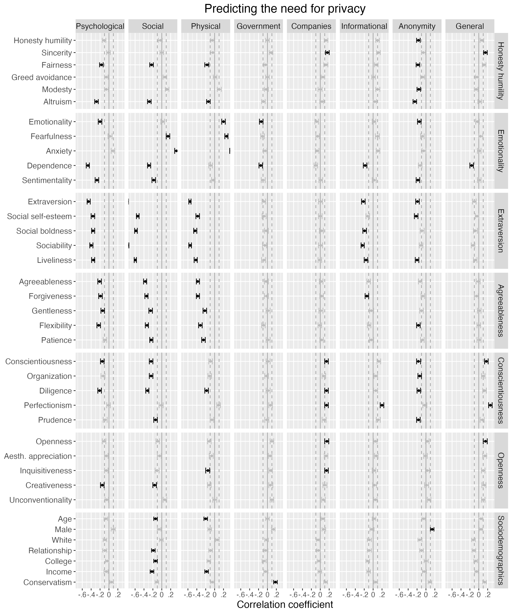

```{r analysis-preferences, include=F}
# Seed for random number generation
set.seed(42)
knitr::opts_chunk$set(cache.extra = knitr::rand_seed,
                      fig.pos = 'h', echo = FALSE)
```

```{r setup, include=F}
# devtools::install_github("tdienlin/td@v.0.0.2.5")  # uncomment to install
library(devtools)
library(english)
library(ggplot2)
library(kableExtra)
library(lavaan)
library(magrittr)
library(naniar)
library(papaja)
library(semPlot)
library(simsem)
library(td)
library(tidyverse)

load("data/workspace_2.RData")

source("custom_functions.R")

# export references
r_refs(file = "bibliography/r-references.bib")
```

<!-- The increasing digitization of everyday life has catapulted  -->
<!-- which has led to several sweeping societal changes such as the commodification and monetization of personal information [@sevignaniPrivacyCapitalismAge2016],  -->
Privacy is a major topic of public discourse and academic interest [@dienlinPrivacyDeadLong2023].
Yet despite its importance, to date we still know surprisingly little about the relation between privacy and personality [@masurSituationalPrivacySelfdisclosure2018, p. 155].
<!-- Why do some people desire more and some people desire less privacy? -->
What can we infer about a person if they desire more privacy?
Are they more introverted, more risk-averse, or more traditional?
<!-- Or do they have more to hide? -->
Asking these questions seems relevant, not least because people who desire more privacy are often regarded with suspicion, having to justify why they want to be left alone. 
Consider the “nothing-to-hide” argument [@soloveVeGotNothing2007], which is that people who oppose state surveillance only do so because they have something to hide---because if you have nothing to hide, you would have nothing to fear. 
Is it true that people who desire more privacy are also more dishonest, greedy, or unfair? 
Or are people simply less extraverted, more diligent, or more prudent? 
With this paper, we seek to answer the following question: 
What can we learn about a person’s personality if they say they desire more privacy?

<!-- This study therefore seeks to understand how the need for privacy is related to dimensions and facets of personality. -->

<!-- It states that data mining and surveillance by government entities poses no threat to the privacy of law-abiding citizens, and is only problematic for people who are engaged in illegal activities who want to hide their information [@soloveVeGotNothing2007, p. 753]. -->
<!-- Summarized as “If you have nothing to hide, you have nothing to fear”, it implies that people who desire more privacy are also more likely to be involved in incriminating activities.  -->
<!-- It is true that people who commit crimes and who are insincere would indeed benefit from greater privacy.  -->
<!-- However, there exist many alternative reasons as to why people feel a greater or lesser need for privacy.  -->
<!-- Among those reasons are dispositional explanations.  -->
<!-- For example, people who need more privacy may be simply more introverted, hesitant, or prudent.  -->

<!-- A better understanding of the relation between personality and privacy is thus useful to illuminate the full range of human motivation for desiring privacy, and thus understanding individual decision-making and behavior surrounding personal privacy.  -->
<!-- Several theories argue that personality determines privacy behaviors [@masurSituationalPrivacySelfdisclosure2018, p. 155].  -->
<!-- However, to date there is almost no empirical research that can be used to develop well-informed hypotheses.  -->

## Privacy and Personality

<!-- We first outline our own understanding of privacy, because the theoretical concept of privacy is multidisciplinary, complicated, and contested [@nissenbaumPrivacyContextTechnology2010, p. 71].  -->
Privacy captures a _withdrawal_ from others or from society in general [@westinPrivacyFreedom1967].
This withdrawal happens _voluntarily_, and it is under a person's _control_ [@westinPrivacyFreedom1967]. 
Privacy is also multi-dimensional. 
On the broadest level, we can differentiate the two dimensions of horizontal and vertical privacy [@schwartzSocialPsychologyPrivacy1968; @masurPrivatheitOnlineKommunikation2018].
Whereas horizontal privacy captures withdrawal from other people or peers, vertical privacy addresses withdrawal from superiors or institutions (e.g., government agencies or businesses). 
In her theoretical analysis, @burgoonPrivacyCommunication1982 argued that privacy has four more specific dimensions: informational, social, psychological, and physical privacy. 
@pedersenDimensionsPrivacy1979  conducted an empirical factor analysis of 94 privacy-related items, finding six dimensions of privacy: 
reserve ("unwillingness to be with and talk with others, especially strangers," p. 1293); isolation ("desire to be alone and away from others," p. 1293), solitude ("being alone by oneself and free from observation by others," p. 1293), intimacy with friends ("being alone with friends," p. 1293), intimacy with family ("being alone with members of one's own family," p. 1293), and anonymity ("wanting to go unnoticed in a crowd and not wishing to be the center of group attention," p. 1293). 
<!-- The need for privacy, then, captures "[a]n individual’s need to selectively control the access of others to the individual self with the aim of achieving a desired level of physical or psychological privacy [...]") [@trepteNeedPrivacy2017, p.1].  -->
<!-- Finally, one can also distinguish between the objective privacy context (e.g., how many users can actually read a post on an SNS?), subjective privacy perceptions (e.g., how many users people _think_ can read a post on an SNS?), and resulting privacy behaviors (e.g., how much do people self-disclose?) [@dienlinPrivacyProcessModel2014]. -->
Building on these understandings of privacy, in this study we employ a multifaceted model of need for privacy. 
We focus on _vertical_ privacy with regard to people’s felt need for withdrawal from surveillance by a) the government and b) private companies; 
_horizontal_ privacy in terms of the perceived need for (c) psychological, (d) social and/or (e) physical withdrawal from other people; 
and _general_ privacy as captured by people’s felt need for (f) informational privacy, (g) anonymity, and (h) privacy in general.
Although all of these dimensions were defined and established in prior research, combining these dimensions into one single comprehensive measure of privacy represents a novel approach.

Acknowledging that various understandings of personality exist, we operationalize personality using the factors and facets of the HEXACO inventory of personality [@leePsychometricPropertiesHEXACO1002018]. 
HEXACO is a large and comprehensive operationalization of personality, and thus is less likely to miss potentially relevant aspects than other operationalizations. 
The HEXACO model stands in the tradition of the Big Five approach [@johnBigFiveTrait1999].
<!-- and represents a broad understanding of personality-->
It includes six factors (discussed below), which have four specific facets each. 
In addition, the HEXACO model includes a sixth factor not present in the Big Five labeled honesty-humility (plus a meta-facet called altruism), which seem particularly well-suited to investigate the nothing-to-hide-argument. 

In predicting the need for privacy, we will primarily focus on the facets, because it is unlikely that the very specific need for privacy dimensions will relate closely to more general personality factors [@bansalImpactPersonalDispositions2010; @junglasPersonalityTraitsConcern2008]. 
And for reasons of scope, below we cannot discuss all four facets for all six factors. Instead, we focus on those we consider most relevant. However, all will be analyzed empirically. 

## Predicting the Need for Privacy

So far, only few studies have analyzed the relation between personality and need for privacy empirically [@hosmanRelationshipsNeedPrivacy1991; @pedersenPersonalityCorrelatesPrivacy1982, see below].
Moreover, we are not aware of a viable theory specifically connecting privacy and personality.
Due to the dearth of empirical studies and the lack of theory, in this study we hence adopt an exploratory perspective. 
<!-- In order to guide the selection of personality dimensions that might explain need for privacy best, it is useful to determine why people actually feel they need privacy.  -->

In order to understand how personality might relate to privacy, we can ask the following question: 
Why do people desire privacy?
Privacy is important.
But according to @trepteNeedPrivacy2017, the need for privacy is only a secondary need---not an end in itself.
Accordingly, privacy satisfies other more fundamental needs such as safety, sexuality, recovery, or contemplation.
@westinPrivacyFreedom1967 similarly defined four ultimate purposes of privacy: (1) self-development (i.e., the integration of experiences into meaningful patterns), (2) autonomy (the desire to avoid being manipulated and dominated), (3) emotional release (the release of tension from social role demands), and (4) protected communication (the ability to foster intimate relationships). 
Privacy facilitates self-disclosure [@dienlinPrivacyProcessModel2014], and thereby social support, relationships, and intimacy [@omarzuDisclosureDecisionModel2000].
But privacy can also have negative aspects. 
It is possible to have too much privacy.
Being cut-off from others can diminish flourishing, nurture deviant behavior, or introduce power asymmetries [@altmanEnvironmentSocialBehavior1975]. 
<!-- The fact that privacy fosters self-disclosure also presents a potential risk, because others might disagree, disapprove, or misuse the information [@petronioCommunicationPrivacyManagement2010].  -->
And privacy can also help conceal wrongdoing or crime. 

<!-- To understand why people desire privacy, we can also adopt an evolutionary perspective. -->
Privacy has strong evolutionary roots [@acquistiHowPrivacyMay2022].
Confronted with a threat---for example, the prototypical tiger---people are inclined to withdraw.
In the presences of opportunities---for example, the unexpected sharing of resources---people open up and approach one another.
Transferred to privacy, we could imagine that if other people, the government, or companies are considered a threat, people are more likely to withdraw and to desire more privacy.
Conversely, if something is considered a resource, people might open up, approach others, and desire less privacy [@altmanPrivacyConceptualAnalysis1976].
Privacy also affords the opportunity to hide less socially desirable aspects of the self from others, which may bestow evolutionary advantages in terms of sexual selection or other social benefits and opportunities. 
Indeed, the need for privacy may have evolved precisely because it offers such advantages.

In what follows, we briefly present each HEXACO factor and how it might relate to need for privacy.

### Honesty-Humility & Altriusm

Honesty-humility consists of the facets sincerity, fairness, greed avoidance, and modesty. 
The meta-facet altruism measures benevolence toward others and consists of items such as “It wouldn't bother me to harm someone I didn’t like” (reversed).  
According to the nothing-to-hide argument, a person desiring more privacy might be less honest, sincere, fair, or benevolent. 
People who commit crimes likely face greater risk from some types of self-disclosure because government agencies and people would enforce sanctions if their activities were revealed [@petronioCommunicationPrivacyManagement2010]. 
In those cases, the government and other people may be perceived as a threat. 
As a consequence, people with lower honesty and sincerity might desire more privacy as a means to mitigate their felt risk [@altmanPrivacyConceptualAnalysis1976].

Empirical studies have linked privacy to increased cheating behaviors [@corcoranMoralityconscienceGuiltScale1987; @coveySelfmonitoringSurveillanceIncentive1989]. 
@coveySelfmonitoringSurveillanceIncentive1989 asked students to solve an impossible maze. 
In the surveillance condition, the experimenter stood in front of the students and closely monitored their behavior. 
In the privacy condition, the experimenter could not see the students. 
Results showed greater cheating among students in the privacy condition, suggesting that in situations with more privacy people are less honest. 
<!-- While this shows a connection between privacy and dishonesty, other studies more directly support the notion that a desire for privacy is related to increased dishonesty. -->
In a longitudinal sample with 457 respondents in Germany [@treptePrivacySelfdisclosureSocial2013], people who felt they needed more privacy were also less authentic (and therefore, arguably, also less honest and sincere) on their online social network profiles (_r_ = -.48).
People who needed more privacy were also less authentic in their personal relationships (_r_ = -.28). 
<!-- Together, these studies suggest the possibility that lack of honesty may relate to an increased need for privacy, especially when it comes to government surveillance.    -->

We do not mean to suggest that it is only dishonest people who feel a need for privacy.
Everyone, including law-abiding citizens, have legitimate reasons to hide specific aspects of their lives [@soloveVeGotNothing2007].
A recent study confirmed this notion, finding that also those people who explicitly endorsed the statement that they would have nothing to hide still engaged in several privacy protective behaviors [@colnagoThereReversePrivacy2023].
Our argument is rather that people lower on the honesty HEXACO factor may feel a greater need for privacy.
Considering all the evidence, it seems more plausible to us that lack of honesty may indeed relate to an increased need for privacy, and perhaps especially when it comes to privacy from authorities such as government agencies. 
<!-- , as governments have the legitimate power to prosecute illegal activities.  -->
<!-- Next, it seems plausible that lack of integrity may relate to an increased need for anonymity, as anonymity makes it more difficult for both government and social agents to identify and address potential wrongdoers.  -->
<!-- Finally, lack of integrity may also relate to an increased need for privacy from other people, as most other people will disapprove of immoral or illegal activities, and could even reveal those activities to authorities. -->

### Emotionality

<!-- Need for privacy might relate to a person’s level of emotionality.  -->
Emotionality is captured by the facets fearfulness, anxiety, dependence, and sentimentality.
People who are anxious may be more likely to view social interactions as risky or threatening [especially with strangers or weak ties, @granovetterStrengthWeakTies1973].
Anxious people might hence desire more privacy. 
People who are more concerned about their privacy (in other words, more anxious about privacy) are more likely to self-withdraw online, for example by deleting posts or untagging themselves from linked content to minimize risk [@dienlinExtendedPrivacyCalculus2016].
On the other hand, the opposite may also be true: 
People who are more anxious in general may desire less privacy from others (especially their strong ties), as a means to cope better with their daily challenges or to seek social approval to either verify or dispel their social anxiety.

People who are more anxious might also desire less privacy from government surveillance. Despite the fact that only 18% of all Americans trust their government “to do what is right,” almost everyone agrees that “it’s the government’s job to keep the country safe” [@pewresearchcenterPublicTrustGovernment2017; @pewresearchcenterDistrustHowAmericans2015]. 
More anxious people might hence consider the government a resource rather than a threat. 
They might more likely consent to government surveillance, given that such surveillance could prevent crime or terrorism. 
On the other hand, it could also be that more anxious people desire more privacy from government agencies, at least on a personal level. 
For example, while they might favor government surveillance of _others_, this does not necessarily include _themselves_. 
Especially if the government is perceived as a threat, as often expressed by members of minority groups, then anxiety might lead one to actually desire more personal privacy.

### Extraversion

Comprising the facets social self-esteem, social boldness, sociability, and liveliness, extraversion is arguably the factor that should correspond most closely to need for privacy. 
<!-- This especially pertains to the sociability facet, which captures whether people prefer to spend their time alone or with company.  -->
<!-- It is plausible that  -->
Conceptually, social privacy and sociability are closely related.
More sociable people are likely more inclined to think of other people as a resource, and thus they should desire less horizontal privacy and less anonymity [e.g., @bussPsychologicalDimensionsSelf2001]. 
Given that privacy is a voluntary withdrawal from society [@westinPrivacyFreedom1967], people who are less sociable, more reserved, or more shy should have a greater need for privacy from others. 

This assumption is supported by several empirical studies. 
People who scored higher on the personality meta-factor plasticity, which is a composite of the two personality factors extraversion and openness, were found to desire less privacy [@mortonMeasuringInherentPrivacy2013].
People who described themselves as introverted thinkers were more likely to prefer social isolation [@pedersenPersonalityCorrelatesPrivacy1982].
Introverted people were more likely to feel their privacy was invaded when they were asked to answer very personal questions [@stoneRelationshipIntroversionExtraversion1986].
@pedersenPersonalityCorrelatesPrivacy1982 reported that the need for privacy related to general self-esteem (but not social self-esteem), which in turn is a defining part of extraversion [@leePsychometricPropertiesHEXACO1002018]. 
Specifically, he found respondents who held a lower general self-esteem were more reserved (_r_ = .29), and needed more anonymity (_r_ = .21) and solitude (_r_ = .24).
Finally, @larsonNeedPrivacyIts1988 and @hosmanRelationshipsNeedPrivacy1991 suggested that people who are more shy also need more privacy.

As a result, we expect that people who are more extraverted also need less social privacy and less privacy in general.
Regarding the other dimensions of privacy, such as privacy from governments or from companies, we do not expect specific effects.

### Agreeableness

Agreeableness has the four facets of forgiveness, gentleness, flexibility, and patience.
It is not entirely clear whether or how agreeableness might relate to the need for privacy, although people who are more agreeable are also moderately less concerned about their privacy [@junglasPersonalityTraitsConcern2008]. 
Thus, because need for privacy and privacy concern are closely related, more agreeable people might desire less privacy. 
To explain, more agreeable people might hold more generous attitudes toward others and are less suspicious that others have malicious motives, and consequently perceive less risk from interacting with others. 

### Conscientiousness

Conscientiousness consists of the facets organization, diligence, perfectionism, and prudence.
Arguably, all facets are about being in control, about reducing relevant risks and future costs.
Because control is a central part of privacy [@westinPrivacyFreedom1967], people who avoid risks, who deliberate, and who plan ahead carefully might prefer to have more privacy because it affords them greater control. 
Especially if others are considered a threat, being risk averse might increase the desire for more horizontal privacy. 
Similarly, if government agencies or private companies are considered a threat, risk averse people might have a stronger desire for vertical privacy. 
In either case, the most cautious strategy to minimize risks of information disclosure would be to keep as much information as possible private. 
Empirical studies have found that people with a stronger control motive require slightly more seclusion (_r_ = .12) and anonymity (_r_ = .15) [@hosmanRelationshipsNeedPrivacy1991].
People who considered their privacy at risk are less likely to disclose information online [e.g., @bolUnderstandingEffectsPersonalization2018]. 
Moreover, conscientious people are more concerned about their privacy [@junglasPersonalityTraitsConcern2008]. 
<!-- But as discussed above, especially with regard to privacy from government surveillance, risk averse people could also desire _less_ privacy, so that the government is able to avert potential threats.  -->
<!-- In sum, think that it is most plausible that people who are more risk averse also desire more privacy in all three contexts measured in this study. -->

### Openness to experience

Openness to experiences comprises the facets aesthetic appreciation, inquisitiveness, creativeness, and unconventionality. 
Openness to experience is also considered a measure of intellect and education. 
In one study it was found that more educated people have more knowledge about how to protect their privacy [@parkDigitalLiteracyPrivacy2013], which could be the result of an increased need for privacy.
Similarly, openness to experience is positively related to privacy concern [@junglasPersonalityTraitsConcern2008].

On the other hand, openness is conceptually the opposite of privacy. 
People more open to new experiences might not prioritize privacy. 
Many digital practices such as social media, online shopping, or online dating offer exciting benefits and new experiences, but pose a risk to privacy. 
People who are more open to new experiences might focus on the benefits rather than the potential risks. 
Hence, either a positive or negative relationship between need for privacy and openness is possible.

### Socio-demographic variables

The need for privacy should also be related to sociodemographic aspects, such as sex, age, education, and income. 
For example, a study of 3,072 people from Germany found that women desired more informational and physical privacy than men, whereas men desired more psychological privacy [@frenerDevelopmentValidationNeed2023].
In a nationally representative study of the U.S. and Japan, people who were older and who had higher income reported more privacy concern. 
More educated people possess more privacy knowledge [@parkDigitalLiteracyPrivacy2013], and as a consequence they might desire more privacy. 
Ethnicity might also correspond to the need for privacy, perhaps because members of minority groups desire more privacy from the government, although not necessarily from other people. 
Some minorities groups (e.g., Black or Native Americans) often report lower levels of trust in white government representatives [@kochRacialMinoritiesTrust2019], which might increase the desire of privacy from government agencies.
Last, we will examine whether one’s political position is related to the need for privacy. 
We could imagine that more right-leaning people desire more privacy from the government, but not necessarily from other people.
People who are more conservative tend to trust the government slightly less [@cookSkepticalAmericanRevisiting2005], which might be associated with an increased need for privacy.
We will also explore whether a person’s romantic relationship status corresponds to their expressed need for privacy. 

### Overview of expectations

The arguments discussed above lead to a number of expectations for our data which we delineate below, in order from most to least confidence in terms of identifying significant effects.
First, we strongly assume that more extraverted people will desire less privacy, especially less social privacy.
We also expect that people who are less honest will express greater need for privacy.
We further assume that more conscientious people will desire more privacy and that more agreeable people may desire less privacy.
Yet it is largely unclear how privacy needs relate to openness to experience and emotionality.
In terms of the sociodemographic variables, we expect females likely need more informational and physical privacy, while males will likely report needing more psychological privacy.
Older, more highly educated, and affluent people are also expected to need more privacy, and we anticipate that people who are ethnic minorities or are politically conservative will express greater need for privacy from the government than from other people.

# Method

This section describes how we determined the sample size, data exclusions, the analyses, and all measures in the study.
The Study was conducted as an online questionnaire, programmed with Qualtrics.
The survey can be found in the [online supplementary material](https://osf.io/e47yw/files/osfstorage/65c363e69b32ca0b4397f002).

## Prestudy

This study builds on a prior project in which we analyzed the same research question [@dienlinWhoNeedsPrivacy2019]. 
This study was already submitted to Collabra but rejected.
The main reasons were that the sample was too small, that not one coherent personality inventory was used, that most privacy measures were designed ad-hoc, and that the inferences were too ambitious. 
We hence decided to treat our prior project as a pilot study and to address the criticism by conducting a new study.
In this new study, we redeveloped our study design, collected a larger sample, implemented the HEXACO inventory together with established need for privacy measures, and overall adopted a more exploratory perspective. 
Being our central construct of interest, we also developed a small number of new items to have a more comprehensive measure of need for privacy.

## Sample

Participants were collected from the professional online survey panel Prolific. 
The sample was representative of the US in terms of age, gender, and ethnicity. 
The study received IRB approval from the University of Vienna (#20210805_067).
Participation took on average `r round(time_m, 0) ` minutes. 
We paid participants \$2.00 for participation, which equals an hourly wage of \$8.00. 

To determine sample size, we ran a priori power analyses using the R package _simsem_ [@R-simsem].
We based our power analysis on a smallest effect size of interest (SESOI; see below).
We only considered effects at least as great as _r_ = .10 as sufficiently relevant to support an effect's existence [@cohenPowerPrimer1992]. <!-- Note that the final analyses will be conducted using structural equation modeling (SEM), for which exact power analyses are difficult to obtain.  -->
<!-- We therefore conducted preliminary power analyses using two-sided bivariate correlations.  -->
To estimate power, we simulated data.
We set the correlation between two exemplary latent factors of personality and privacy variable to be $\Psi$ = .10 (the SESOI).
We, furthermore, set the latent factor loadings to be $\lambda$ = .85.
<!-- Hence, the following power analyses are not exact but rather a rough guide to get a better idea of the required minimum sample size. -->
<!-- Oftentimes, researchers opt for an alpha error of 5% and a power of 80% (i.e., beta error of 20%). -->
Adopting an exploratory perspective, and not wanting to miss actually existing effects, we considered both alpha and beta errors to be equally relevant, resulting in balanced/identical alpha and beta errors [@rouderThereFreeLunch2016].
Because balanced alpha and beta errors of 5% were outside of our budget, we opted for balanced alpha and beta errors of 10%.
A power analysis with an alpha and beta error of 10% and an effect size of _r_ = .10 revealed that we required a sample size of _N_ = `r power_80[["HEX_HOH_SIN~~NFP_PHY"]]`.
To account for potential attrition (see below), we oversampled by five percent, leading to a planned sample size of N = `r round(power_80[["HEX_HOH_SIN~~NFP_PHY"]]*.05, 0) + power_80[["HEX_HOH_SIN~~NFP_PHY"]]`.
<!-- Hence, we will use two inference criteria: Effects need to show a _p_-value of below _p_ = 10% and an effect size of at least _r_ = .10.  -->
In the end, `r n_finished` respondents successfully finished our study, slightly exceeding our plans.

## Exclusions and Imputation

We individually checked answers for response patterns such as straight-lining or missing of inverted items.
We planned to conservatively remove participants with clear response patterns.
However, as no clear patterns emerged we maintained all participants.
We automatically excluded participants who missed the two attention checks we implemented.
Overall, 30 participants were filtered out automatically by Prolific, not counting toward our quota.
Participants who missed one attention check were checked individually regarding response patterns.
Again, no clear patterns emerged.
We planned to remove participants below the minimum participation age of 18 years.
As no minors took part in our study we did not exclude any participant for this reason.
We planned to remove respondents with unrealistically fast responses (three standard deviations below the median response time). 
The median response time was `r round(time_med / 60, 0)` minutes and the standard deviation `r round(time_sd / 60, 0)` minutes. 
Hence, three SDs below median was `r round(time_crit_init / 60, 0)` minutes, hence not informative. 
Instead, we decided to remove respondents who took less than five minutes answering the questionnaire, which we considered unreasonably fast.
We removed `r n_speeding %>% english::english()` participants for this reason.
<!-- We will exclude respondents if they answer fewer than 50% of all questions.  -->

We planned to impute missing responses using multiple imputation with predictive mean matching (ten datasets, five iterations, using variables that correlate at least with _r_ = .10). 
However, as there were only `r n_miss(d)` answers missing in total (`r round(prop_miss(d) * 100, 3)` percent), we decided not to impute any data.
The final sample size was _N_ = `r nrow(d)`.

## Analyses

<!-- We will test items for potential ceiling and floor effects.  -->
<!-- If means are below 1.5 or above 6.5, these items will be excluded. -->
The factorial validity of the measures and the relations were tested using structural equation modeling. 
If Mardia’s test showed that the assumption of multivariate normality was violated, we used the more robust Satorra-Bentler scaled and mean-adjusted test statistic (MLM) as estimator (or, in the few cases of missing data MLR plus FIML estimation).
We tested each scale in a confirmatory factor analysis. 
To assess model fit, we used more liberal fit criteria to avoid overfitting (CFI > .90, TLI > .90, RMSEA < .10, SRMR < .10) [@klinePrinciplesPracticeStructural2016]. 
In cases of misfit, we conservatively altered models using an a priori defined analysis pipeline (see online supplementary material).
As a “reality check,” we tested items for potential ceiling and floor effects. 
If means were below 1.5 or above 6.5, we preregistered to exclude these items.
However, as no item was outside these threshold, no items were excluded.

We wanted to find out _who_ needs privacy, and not so much _what causes_ the need for privacy.
Hence, to answer our research question, in a joint model combining all variables (including sociodemographic variables) we analyzed the variables' bivariate relations. 
To predict the need for privacy, we first used the six personality factors.
Afterward, we predicted privacy using the more specific facets. 
To get a first idea of the variables' potential causal relations, we also planned to run latent structural regression models.
However, because model fit was not acceptable we analyzed the potential effects in a multiple regression using the mean values of the observed scores. 
<!-- We will also test which individual items best predict need for privacy. -->

We used two measures as inference criteria: statistical significance and effect size. 
Regarding statistical significance, we used an alpha value of 10%.
Regarding effect size, we defined a SESOI of _r_ = .10, and thereby a null-region ranging from -.10 to .10.
As proposed by @dienesUsingBayesGet2014, we considered effects to be meaningful if the confidence interval fell outside of the null region (e.g., .15 to .25 or -.15 to -.25).
We considered effects irrelevant if the confidence interval fell completely within the null region (e.g., .02 to .08).
And we suspended judgement if the confidence intervals partially included the null region (e.g., .05 to .15).

Fully latent SEMs seldom work instantly, often requiring modifications to achieve satisfactory model fit.
Although we explicated our analysis pipeline, there still remained several researcher degrees of freedom. 
We planned to use fully latent SEM because we consider it superior to regular analyses such as correlation or regression using manifest variables [@klinePrinciplesPracticeStructural2016]. 
However, as several of the scales showed suboptimal fit, we decided to report the more conservative correlations of average scores.
In the online supplementary material (OSM) we also share the results of alternative analyses, such as fully latent SEMs.

## Measures

All items were answered on a 7-point Likert scale ranging from 1 (_strongly disagree_) to 7 (_strongly agree_).[^2] 
A list of all the items that we were used are reported in the online supplementary material. 
The personality and privacy items were presented in random order, and the sociodemographic questions were asked at the end.
Online we also report all item statistics and their distribution plots.

[^2]: Note that the HEXACO inventory normally uses 5-point scales. 
Because we were not interested in comparing absolute values across studies, we used 7-point scales to have a uniform answer format across all items.

### Need for privacy

Although there exist several operationalizations of need for privacy [@bussPsychologicalDimensionsSelf2001; @pedersenDimensionsPrivacy1979; @frenerDevelopmentValidationNeed2023; @marshallDimensionsPrivacyPreferences1974], we are not aware of one encompassing, comprehensive, and up-to-date scale. 
Hence, we used both existing scales and self-developed items, some of which were tested in our pilot study. 
Ad-hoc scales were validated using the following procedure:
We (a) collected qualitative feedback from three different privacy experts;[^experts]
(b) followed the procedure implemented by @patalayAssessingReadabilitySelfreported2018 to test (and adapt) the items using four established readability indices (i.e., Flesch–Kincaid reading grade, Gunning Fog Index, Coleman Liau Index, and the Dale–Chall Readability Formula); (c) like @frenerDevelopmentValidationNeed2023, assessed convergent validity by collecting single-item measures of privacy concern and privacy behavior, for which we expect to find small to moderate correlations; (d) analyzed all items in confirmatory factor analyses as outlined above.

[^experts]: The three experts who provided feedback were Moritz Büchi (University of Zurich), Regine Frener (University of Hohenheim), and Philipp Masur (VU Amsterdam).

Overall, we collected 32 items measuring need for privacy, with eight subdimensions that all consisted of four items each. 
Three subdimensions captured horizontal privacy---namely _psychological_, _social_, and _physical_ privacy from other individuals. 
Psychological and physical privacy were adopted from @frenerDevelopmentValidationNeed2023.
Because @frenerDevelopmentValidationNeed2023 could not successfully operationalize the dimension of social privacy, building on @burgoonPrivacyCommunication1982 we self-designed a new social privacy dimension, which in the prestudy showed satisfactory fit. 
Two subdimensions measured vertical privacy.
The first subdimension was _government surveillance_, which represents the extent to which people want the government to abstain from collecting information about them. 
The scale was pretested and showed good factorial validity. 
The second subdimension was need for privacy from _companies_, which we measured using four new self-designed items.
Finally, three subdimensions captured general privacy. 
The first subdimension was _informational_ privacy, with items adopted from @frenerDevelopmentValidationNeed2023.
The second subdimension was _anonymity_, which captured the extent to which people feel the need to avoid identification in general.
The scale was pretested and showed good factorial validity; one new item was designed for this study.
Third, we also collected a new self-developed measure of _general_ need for privacy.

### Personality

Personality were measured using the HEXACO personality inventory. 
The inventory consists of six factors with four facets each, including the additional meta scale of "altruism".

# Results

We first tested the factorial validity of all measures.
When analyzed individually, most measures showed satisfactory model fit, not requiring any changes.
Some measures showed satisfactory model fit after small adaptions, such as allowing items to covary.
In terms of reliability, most measures showed satisfactory results.
However, some measures such as altruism, unconventionality, or anonymity showed insufficient reliability.
Instead of strongly adapting measures, we decided to maintain the initial factor structure and did not delete any items or did not introduce substantial changes to the factors.
For an overview of all measures, their descriptives and factorial validity, see Table \@ref(tab:tab-des).
Although individually most of the measures showed good fit, when analyzed together fit decreased substantially, below acceptable levels. 
As a result, we conservatively decided to analyze our data using the variables' observed mean scores.

```{r tab-des, cache=F, warning=F, message=F, prompt=F}
apa_table(
  tab_des, 
  stub_indents = list(
    "Personality" = c(1:31),
    "Need for Privacy" = c(32:39)
    ),
  align = c("l", rep("r", 8)),
  caption = "Factorial validity of all measures.",
  font_size = "small",
  escape = FALSE
  )
```

The need for privacy measures showed good convergent validity.
If respondents reported higher needs for privacy they were also more concerned about their privacy, with coefficients ranging from _r_ = .21 to _r_ = .73.
The only exception was the relation between privacy concerns and the need for social privacy, which was very small (_r_ = .09).
Similarly, if respondents reported higher needs of privacy they also engaged in more privacy behaviors, with coefficients ranging from _r_ = .20 to _r_ = .71
The only exception was the relation between privacy behavior and the need for social privacy, which was virtually nonexistent (_r_ = .01), and the need for physical privacy, which was very small (_r_ = .09).
See online supplementary material for all results.

People who reported being less honest and humble needed more anonymity (`r get_res("Honesty humility", "Anonymity")`).
Looking at facets, more anonymity was needed by people who reported being less fair (`r get_res("Fairness", "Anonymity")`), less modest (`r get_res("Modesty", "Anonymity")`), and less altruistic (`r get_res("Altruism", "Anonymity")`).
However, less sincere people needed less privacy from companies (`r get_res("Sincerity", "Companies")`) and less privacy in general (`r get_res("Sincerity", "General")`).
Effects were small or small-to-medium sized.

Several relations between emotionality and need for privacy were found.
More emotional people needed less psychological privacy (`r get_res("Emotionality", "Psychological")`), less privacy from the government (`r get_res("Emotionality", "Government")`), less anonymity (`r get_res("Emotionality", "Anonymity")`)---but also more physical privacy (`r get_res("Emotionality", "Physical")`).
More anxious respondents needed substantially more social (`r get_res("Anxiety", "Social")`) and physical privacy (`r get_res("Anxiety", "Physical")`).
Similarly, more fearful respondents needed more social (`r get_res("Fearfulness", "Social")`) and physical privacy (`r get_res("Fearfulness", "Physical")`).
More dependent participants generally needed less privacy, including less psychological (`r get_res("Dependence", "Psychological")`) and social privacy (`r get_res("Dependence", "Social")`), less privacy from the government (`r get_res("Dependence", "Government")`), and less informational (`r get_res("Dependence", "Informational")`) and general privacy (`r get_res("Dependence", "General")`).
A similar picture for more sentimental participants emerged, who needed less psychological (`r get_res("Sentimentality", "Psychological")`) and social privacy (`r get_res("Sentimentality", "Social")`) and less anonymity (`r get_res("Sentimentality", "Anonymity")`).

More extraverted people reported they needed a lot less privacy.
They wanted less psychological privacy (`r get_res("Extraversion", "Psychological")`), social privacy (`r get_res("Extraversion", "Social")`), and physical privacy (`r get_res("Extraversion", "Physical")`), less informational privacy (`r get_res("Extraversion", "Informational")`) and less anonymity (`r get_res("Extraversion", "Anonymity")`).
Effect sizes were oftentimes large.
All facets showed virtually the same relations, with small differences in effect sizes.

More agreeable participants showed a similar pattern, needing less psychological (`r get_res("Agreeableness", "Psychological")`), social privacy (`r get_res("Agreeableness", "Social")`), and physical privacy (`r get_res("Agreeableness", "Physical")`).
The facets showed virtually the same pattern.
Effect sizes were substantial, but on the whole smaller than those for extraversion.

Although more conscientious respondents generally needed less privacy, the pattern was varied.
More conscientious respondents needed less psychological (`r get_res("Conscientiousness", "Psychological")`) and less social privacy (`r get_res("Conscientiousness", "Social")`), as well as less anonymity (`r get_res("Conscientiousness", "Anonymity")`).
However, when asked about privacy in general more conscientious people responded to need more (`r get_res("Conscientiousness", "General")`).
Looking at facets of conscientiousness, more organized people needed less social privacy (`r get_res("Organization", "Social")`) and less anonymity (`r get_res("Organization", "Anonymity")`). 
More prudent participants needed less anonymity (`r get_res("Prudence", "Anonymity")`).
More diligent people needed less psychological (`r get_res("Diligence", "Psychological")`), social (`r get_res("Diligence", "Social")`), and physical privacy (`r get_res("Diligence", "Physical")`) as well as less anonymity (`r get_res("Diligence", "Anonymity")`).
At the same time, more perfectionist respondents reported needing more informational (`r get_res("Perfectionism", "Informational")`) and more general privacy (`r get_res("Perfectionism", "General")`).

Whether or not respondents were open to new experiences was largely unrelated to how much privacy they needed.
Only three facets showed relevant but still small relations. 
Respondents who reported being more creative needed less psychological (`r get_res("Creativeness", "Psychological", "tab_cor")`) and less social privacy (`r get_res("Creativeness", "Social")`). 
More inquisitive respondents needed less physical privacy (`r get_res("Inquisitiveness", "Physical")`).

```{r tab-dim, cache=F, warning=F, message=F, prompt=F}
apa_table(
  tab_cor_dim_m, 
  # tab_dim,
  # stub_indents = list("Sociodemographics" = c(1:6)),
  col_spanners = list(`Need for privacy` = c(2, 9)),
  align = c("l", rep("r", 8)),
  caption = "Predicting the need for privacy dimensions using personality factors.",
  font_size = "small",
  escape = FALSE
  )
```

```{r tab-fac, cache=F, warning=F, message=F, prompt=F}
apa_table(
  # tab_fac,
  tab_cor_fac_m, 
  stub_indents = list(
    "Honesty humility" = c(1:5),
    "Emotionality" = c(6:9),
    "Extraversion" = c(10:13),
    "Agreeableness" = c(14:17),
    "Conscientiousness" = c(18:21),
    "Openness to experiences" = c(22:25)
    ),
  col_spanners = list(`Need for privacy` = c(2, 9)),
  align = c("l", rep("r", 8)),
  caption = "Predicting the need for privacy dimensions using personality facets.",
  font_size = "small",
  escape = FALSE
  )
```

Not many meaningful relations between sociodemographic variables and need for privacy were found.
Older participants needed less social (`r get_res("Age", "Social")`) and less physical privacy (`r get_res("Age", "Physical")`). 
Male participants needed more anonymity (`r get_res("Male", "Anonymity")`). 
Less social privacy was needed by people in a relationship (`r get_res("Relationship", "Social")`), with a college degree (`r get_res("College", "Social")`), and with higher income (`r get_res("Income", "Social")`). 
People with higher income also reported needing less physical privacy (`r get_res("Income", "Physical")`). 
More politically conservative respondents reported needing more privacy from the government (`r get_res("Conservatism", "Government")`).

In Table \@ref(tab:tab-dim), we report how the personality dimensions predicted need for privacy.
In Table \@ref(tab:tab-fac), we report how the personality facets predicted need for privacy.
In Table \@ref(tab:tab-ses), we report how sociodemographics predicted need for privacy.
In Figure \@ref(fig:fig-cor), you can find how all variables---dimensions, facets, and sociodemographics---predicted the need for privacy. 

```{r tab-ses, cache=F, warning=F, message=F, prompt=F}
# tab_ses %<>% set_names(c("Sociodemographics", vars_pri_txt_brk))
tab_cor_ses_m %<>% 
  set_names(c("Sociodemographics", vars_pri_txt_abr))

apa_table(tab_cor_ses_m,
          # stub_indents = list("Sociodemographics" = c(1:6)),
          align = c("l", rep("r", 8)),
          col_spanners = list(`Need for privacy` = c(2, 9)),
          caption = "Predicting the need for privacy dimensions using sociodemographic variables.",
          font_size = "small",
          escape = FALSE
          )
```

In exploratory analyses we analyzed how personality facets might have potentially caused need for privacy.
We found that the psychological need for privacy was explained by two variables.
The need for psychological privacy was potentially reduced by extraversion (`r get_res("Extraversion", "Psychological", "tab_reg")`) and by emotionality (`r get_res("Emotionality", "Psychological", "tab_reg")`). 
The need for informational privacy was also potentially affected by extraversion and emotionality.
Being more extraverted substantially decreased the need for psychological privacy (`r get_res("Extraversion", "Social", "tab_reg")`), as did being more emotional (`r get_res("Emotionality", "Social", "tab_reg")`).
Physical privacy was determined by again extraversion, but also by agreeableness and conscientiousness.
Being more extraverted potentially decreased the need for physical privacy (`r get_res("Extraversion", "Physical", "tab_reg")`); 
being more agreeable likewise decreased the need for physical privacy (`r get_res("Agreeableness", "Physical", "tab_reg")`);
however, being more conscientious increased the need for physical privacy (`r get_res("Conscientiousness", "Physical", "tab_reg")`).
The need for privacy from the government was potentially affected by the two factors of openness and conservatism.
Being more open to new experiences potentially increased the need for privacy from the government (`r get_res("Openness", "Government", "tab_reg")`), as did being more politically conservative (`r get_res("Conservatism", "Government", "tab_reg")`).
The need for privacy from companies was potentially affected by the same two factors.
Being more open to new experiences potentially increased the need for privacy from companies (`r get_res("Openness", "Companies", "tab_reg")`), as did being more politically conservative (`r get_res("Conservatism", "Companies", "tab_reg")`).
Being extraverted and conscientious potentially affected the need for informational privacy.

```{r fig-cor, fig.cap="Results of bivariate correlations between personality and need for privacy. Bold: Effects that are statistically significant and larger than \\textit{r} = .10 / -.10.", out.width = "\\textwidth", cache=F, warning=F, message=F, prompt=F, fig.pos='H'}
# fig_desc

```

Whereas being more extraverted likely decreased the need for informational privacy (`r get_res("Extraversion", "Informational", "tab_reg")`), being more conscientious likely increased the need for informational privacy (`r get_res("Conscientiousness", "Informational", "tab_reg")`).
The need for anonymity was potentially affected by extraversion.
More extraverted people need less anonymity (`r get_res("Extraversion", "Anonymity", "tab_reg")`).
Finally, the general need for privacy was potentially affected by four variables.
Being extraverted again likely decreased the general need for privacy (`r get_res("Conservatism", "Companies", "tab_reg")`).
However, the general need for privacy was potentially increased by being more conscientious (`r get_res("Conscientiousness", "General", "tab_reg")`), more conservative (`r get_res("Conservatism", "General", "tab_reg")`), and more open to experiences (`r get_res("Openness", "General", "tab_reg")`).

In Figure \@ref(fig:fig-reg), you can find how privacy dimensions and sociodemographics potentially affected the need for privacy. 

```{r fig-reg, fig.cap="Results of multiple regression. Bold: Effects that are statistically significant and larger than \\textit{$\\beta$} = .10 / -.10.", out.width = "\\textwidth", cache=F, warning=F, message=F, prompt=F, fig.pos='h'}
# fig_desc
knitr::include_graphics("figures/fig_reg.png")
```

# Discussion

In this study we analyzed the relation between personality and need for privacy.
The data came from _N_ = `r n_used` respondents from the US, representative in terms of age, gender, and ethnicity. 
The results showed several meaningful relations between personality and need for privacy that were statistically significant (_p_ < 10%) and not trivial in size (i.e., 90% CI _r_ $\geq$ .10).
In a multiple regression with all personality dimensions and sociodemographic variables, we also explored potential causal effects.

As expected, the need for privacy was most closely related to extraversion.
Participants who were more extraverted generally needed substantially less privacy. 
The relation between extraversion and social privacy was particularly large, suggesting that social privacy and extraversion overlap conceptually.
In addition, almost all subscales of extraversion showed similar patterns: 
People with greater social boldness, self-esteem, or liveliness all needed substantially less privacy from other people and less physical, psychological, and informational privacy.
Extraverted people reach out to others, share their inner lives, are confident around others---which reflects in a reduced need for privacy.

The personality factor next closely related to need for privacy was agreeableness. 
Although this finding aligned with our prior expectation, we were surprised by the strength of the relations.
More agreeable respondents needed less privacy in general.
In particular, more agreeable respondents needed substantially less psychological, social, and physical privacy.
More agreeable people have fewer conflicts with others, are more easy to get along with.
They likely see others less as a threat, and hence have a reduced need for privacy.
No relevant relations with need for privacy from government and companies exist, suggesting that agreeableness---a personality trait mostly relevant in interpersonal contexts---might not extend to the need for privacy in these public domains.

In analyzing how the honesty humility factor relates to need for privacy, we analyzed the nothing-to-hide argument.
As expected, our results provided support for the nothing-to-hide argument, especially with regard to the need for anonymity.
Respondents who needed more anonymity were less honest, less fair, less modest, and less altruistic.
Respondents who were less fair and less altruistic also needed more psychological, social, and physical privacy.
Less honest participants required more anonymity and privacy from other people, be it psychologically, socially, or physically.
However, honesty was unrelated to the need for privacy from government and companies or informational and general privacy.
If anything, people who were more sincere actually desired more privacy from companies and more privacy in general.
So although less honest people needed more privacy in several dimensions, this pattern is not general but varied and nuanced.

Emotionality showed mixed relations with need for privacy, which confirmed our ambivalent a priori expectations.
More emotional people desired less psychological privacy, less privacy from the government, and less anonymity. 
At the same time, they needed more physical privacy. 
Whereas they want closer bonds to people close to them, they are wary of strangers entering their personal spaces.
Fearful and anxious people wanted more social and more physical privacy, while dependent and sensitive people wanted less.
It seems that more emotional people have subtle and varied approach- versus avoidance preferences.

Contrary to our expectations, conscientiousness showed a varied relation with need for privacy.
More conscientious people needed less psychological and social privacy and less anonymity.
Asked about privacy in general, however, they answered they needed more.
This relations was driven by the subscale perfectionism.
More perfectionist people preferred both more informational privacy and more privacy in general---perhaps to have more options and leeway to adapt plans. 
More diligent people needed less privacy from other people, less psychological privacy, and less physical privacy. 
Speculating about a potential explanation, we could imagine that similar to the nothing-to-hide argument more diligent people might have less to be afraid of.

Although openness might be the opposite of privacy semantically, empirically next to no meaningful relations with need for privacy were found.
The main dimension showed no relevant relationships.
The facet creativity was meaningfully related to psychological and social privacy, such that more creative people needed less psychological and social privacy.
It might be that more creative people generally think of others as resources, thriving from their inputs and exchanges. 
More inquisitive people needed less physical privacy from others.
They might see others as a resource, valuing closer exchanges with people unknown to them.

In addition, we looked at relations between need for privacy and various sociodemographic variables.
Contrary to our expectations, older participants desired less privacy from others, both socially and physically. 
It is an open question as to whether this relation represents a developmental mechanism or a difference between cohorts.
With increasing age social relations become more sparse, and perhaps to compensate older people prefer more contact with others.
But it could also be a difference between cohorts. 
Younger people nowadays have fewer social contacts than before, often attributed to increases in time spent online.
Hence, it could also be that younger generations prefer more solitude than the generations beforehand.

We expected that males would desire more psychological privacy but less social and physical privacy than females.
Although in our data these relations were statistically significant as well, the effects sizes were too small to be considered meaningful.
The only meaningful gender effect we found was with regard to anonymity.
Males needed more anonymity than females.

People in relationships needed less social privacy.
This makes sense as being in a relationship implies a minimum openness to committing to others. 
Contrary to our expectations, respondents with a college degree and with greater income all reported lower levels of need for social privacy.
Having fewer educational and financial resources might result in fewer social opportunities, reflecting in an increased need for social privacy. 
More politically conservative respondents needed more privacy from the government---which we expected given the general political tendencies of conservatives to prefer fewer state regulations and interferences.
Finally, no meaningful relations with ethnicity were found.
For example, contrary to what we expected we did not find that minority groups desired more privacy from the government.

Finally, we also looked at the potential impact of personality on need for privacy.
Results were comparable, in that extraversion turned out to be the major cause of need for privacy.
However, there were also some changes.
Most notably, when controlling for other personality dimensions and sociodemographics, results implied that being more conscientious increases the need for physical, informational, and general privacy.
Similarly, being more open to new experiences might increase the need for privacy from the government, from companies, and for privacy in general.
Finally, multiple regression results suggested that being conservative does not only increase the need for privacy from the government, but also from companies and for privacy in general.
All other sociodemographic variables ceased to be significant.

Looking at the results more broadly, we make four general observations.
First, it makes sense to differentiate different levels of need for privacy.
Many personality traits showed meaningful relations with some dimension, but no or even opposite relations with others.
To illustrate, whereas more conscientious people desired less psychological privacy and less privacy from other, when asked about privacy in general they needed more. 
General need for privacy rather represents a cognitive appraisal, whereas social or psychological privacy might be more experienced and psychological. 

Second, the need for privacy from companies and the government, both vertical forms of privacy, showed next to no meaningful relations with personality.
Most relations were found on the horizontal level, suggesting that personality shows more strongly in these more social and interpersonal aspects of privacy.

Third, although we found support for the nothing-to-hide-argument, our results also support the reasoning of the argument's critics.
Although desiring more anonymity was related to less honesty, fairness, and altruism, these relations were not particularly large.
Next, needing anonymity is insufficient to assume reduced honesty.
Our results underscore that many other personality aspects related to an increased need of anonymity.
Less emotional, less extraverted, and more conscientious people also needed more anonymity.
Finally, when analyzed together with the other predictors, honesty and humility ceased to be a relevant predictor.

This leads to our fourth general observation.
Our main interest was to determine what predicts the need for privacy.
What can we learn about a person given their need for privacy?
We analyzed these questions in correlation analyses.
In addition, we also explored the potential causal effects in a multiple regression.
Here, a somewhat different picture emerged.
Several correlations we found might not be the results of a causal processes.
At the same time, some causal effects might also be surpressed in correlation analyses.

## Limitations

Not all personality and privacy measures showed good fit. 
Especially when analyzed together, fit was not satisfactory. 
Likewise, some measures such as altruism, unconventionality, or anonymity showed low reliability. 
The results of these variables need to be interpreted more cautiously.
Instead of deleting items or changing the factor structure, to avoid overfitting we decided to maintain the measures' original factor structure.

For this reason, instead of reporting the results from latent structural equation modelling, we reported the results of the correlations of the observed variables' means. 
We report the results of the latent analyses online.
The results are highly comparable, with the major difference that effect sizes in the latent models tended to be larger.
The results reported here are hence more conservative and likely underestimate the true effect sizes.

\newpage

# References

<!-- \begingroup -->
<!-- \setlength{\parindent}{-0.5in} -->
<!-- \setlength{\leftskip}{0.5in} -->
<div id = "refs"></div>
<!-- \endgroup -->

# Contributions

Conception and design: TD, MM. Data acquisition: TD. Code: TD. Analysis and interpretation of data: TD, MM; First draft: TD; Revisions & Comments: TD & MM.

# Funding Information

During the conception and data collection of the prestudy, TD was funded by The German Academic Scholarship Foundation (German: Studienstiftung des deutschen Volkes), which financially supported a research stay at UCSB. During some time working on the article and while at University of Hohenheim, TD was funded by the Volkswagen Foundation (German: Volkswagenstiftung), grant "Transformations of Privacy". TD is now funded by a regular and not-tenured assistant professorship at University of Vienna. MM is funded by a regular and tenured full professorship at UCSB.

# Conflict of Interests

Both authors declare no conflict of interests.
  
# Supplementary Material

All the stimuli, presentation materials, participant data, analysis scripts, and a reproducible version of the manuscript can be found on the open science framework (https://osf.io/e47yw/). The paper also has a companion website where all materials can be accessed (https://tdienlin.github.io/Who_Needs_Privacy_RR/proposal.html).

# Data Accessibility Statement

The data are shared on the open science framework (https://osf.io/e47yw/) and on github.
