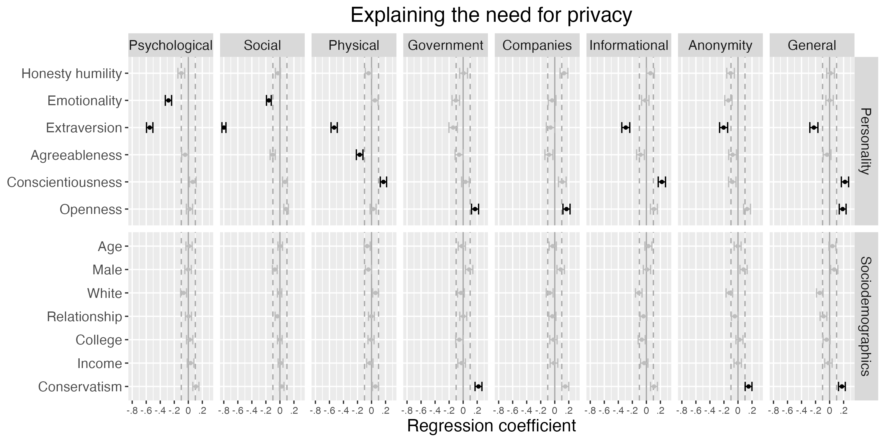

```{r analysis-preferences, include=F}
# Seed for random number generation
set.seed(42)
knitr::opts_chunk$set(cache.extra = knitr::rand_seed,
                      fig.pos = 'h', echo = FALSE)
```

```{r setup, include=F}
# devtools::install_github("tdienlin/td@v.0.0.2.5")  # uncomment to install
packages <- c("devtools", "english", "ggplot2", "kableExtra", "lavaan", 
              "magrittr", "papaja", "semPlot", "td", "tidyverse")
lapply(packages, library, character.only = TRUE)
load("data/workspace.RData")

# export references
r_refs(file = "bibliography/r-references.bib")
```

<!-- The increasing digitization of everyday life has catapulted  -->
<!-- which has led to several sweeping societal changes such as the commodification and monetization of personal information [@sevignaniPrivacyCapitalismAge2016],  -->
Privacy is a major topic of public discourse and academic interest [@dienlinPrivacyDeadLong2022].
Yet despite its importance, to date we still know surprisingly little about the relation between privacy and personality [@masurSituationalPrivacySelfdisclosure2018, p. 155].
<!-- Why do some people desire more and some people desire less privacy? -->
What can we infer about a person if they desire more privacy?
Are they more introverted, more risk-averse, or more traditional?
<!-- Or do they have more to hide? -->
Asking this question seems relevant, not least because people who desire more privacy are often regarded with suspicion, having to justify why they want to be left alone. 
Consider the “nothing-to-hide” argument [@soloveVeGotNothing2007]: People who oppose state surveillance only do so because they have something to hide, because if you have nothing to hide, you would have nothing to fear. 
Is it true that people who desire more privacy are also more dishonest, greedy, or unfair? 
Or are people simply less extroverted, more diligent, or more prudent? 
With this paper, we seek to answer the following question: What can we learn about a person’s personality if they say they desire more privacy?

<!-- This study therefore seeks to understand how the need for privacy is related to dimensions and facets of personality. -->

<!-- It states that data mining and surveillance by government entities poses no threat to the privacy of law-abiding citizens, and is only problematic for people who are engaged in illegal activities who want to hide their information [@soloveVeGotNothing2007, p. 753]. -->
<!-- Summarized as “If you have nothing to hide, you have nothing to fear”, it implies that people who desire more privacy are also more likely to be involved in incriminating activities.  -->
<!-- It is true that people who commit crimes and who are insincere would indeed benefit from greater privacy.  -->
<!-- However, there exist many alternative reasons as to why people feel a greater or lesser need for privacy.  -->
<!-- Among those reasons are dispositional explanations.  -->
<!-- For example, people who need more privacy may be simply more introverted, hesitant, or prudent.  -->

<!-- A better understanding of the relation between personality and privacy is thus useful to illuminate the full range of human motivation for desiring privacy, and thus understanding individual decision-making and behavior surrounding personal privacy.  -->
<!-- Several theories argue that personality determines privacy behaviors [@masurSituationalPrivacySelfdisclosure2018, p. 155].  -->
<!-- However, to date there is almost no empirical research that can be used to develop well-informed hypotheses.  -->

## Privacy and Personality

<!-- We first outline our own understanding of privacy, because the theoretical concept of privacy is multidisciplinary, complicated, and contested [@nissenbaumPrivacyContextTechnology2010, p. 71].  -->
Privacy captures a _withdrawal_ from others or from society in general [@westinPrivacyFreedom1967].
This withdrawal happens _voluntarily_, and it is under a person's _control_ [@westinPrivacyFreedom1967]. 
Privacy is also multi-dimensional. 
On the broadest level, we can differentiate the two dimensions of horizontal and vertical privacy [@schwartzSocialPsychologyPrivacy1968; @masurPrivatheitOnlineKommunikation2018].
Whereas horizontal privacy captures withdrawal from other people or peers, vertical privacy addresses withdrawal from superiors or institutions (e.g., government agencies or businesses). 
In her theoretical analysis, @burgoonPrivacyCommunication1982 argued that privacy has four more specific dimensions: informational, social, psychological, and physical privacy. 
@pedersenDimensionsPrivacy1979  conducted an empirical factor analysis of 94 privacy-related items, finding six dimensions of privacy: 
reserve, isolation, solitude, intimacy with friends, intimacy with family, and anonymity: 
<!-- The need for privacy, then, captures "[a]n individual’s need to selectively control the access of others to the individual self with the aim of achieving a desired level of physical or psychological privacy [...]") [@trepteNeedPrivacy2017, p.1].  -->
<!-- Finally, one can also distinguish between the objective privacy context (e.g., how many users can actually read a post on an SNS?), subjective privacy perceptions (e.g., how many users people _think_ can read a post on an SNS?), and resulting privacy behaviors (e.g., how much do people self-disclose?) [@dienlinPrivacyProcessModel2014]. -->
Building on this work, in this study we employ a multifaceted model of need for privacy. 
We focus on _vertical_ privacy with regard to people’s felt need for withdrawal from (a) government surveillance and (b) private companies; 
_horizontal_ privacy in terms of the perceived need for (c) psychological, (d) social and/or (e) physical withdrawal from other people; 
and _general_ privacy as captured by people’s felt need for (f) informational privacy, (g) anonymity, and (h) privacy in general.

We understand and measure personality using the HEXACO inventory of personality [@leePsychometricPropertiesHEXACO1002018]. 
HEXACO is a large and comprehensive operationalization of personality, and thus is less likely to miss potentially relevant factors and facets than other personality constructs. 
The HEXACO model stands in the tradition of the Big Five approach [@johnBigFiveTrait1999].
<!-- and represents a broad understanding of personality-->
It includes six factors (discussed below), which have four specific facets each. 
In addition, the HEXACO model includes a sixth factor not present in the Big Five labeled honesty-humility (plus a meta-facet called altruism), which seem particularly well-suited to investigate the nothing-to-hide-argument. 

In predicting the need for privacy, we will primarily focus on the facets, because it is unlikely that the very specific need for privacy dimensions will relate closely to more general personality factors  
<!-- For example, consider that privacy concern, a variable conceptually close to need for privacy, shows only small relations to the Big Five factors  -->
[@bansalImpactPersonalDispositions2010; @junglasPersonalityTraitsConcern2008]. 
And for reasons of scope, below we cannot discuss all four facets for all six factors. Instead, we focus on those we consider most relevant. However, all we be analyzed empirically. 

## Predicting the Need for Privacy

So far, very few studies have analyzed the relation between personality and need for privacy empirically [@hosmanRelationshipsNeedPrivacy1991; @pedersenPersonalityCorrelatesPrivacy1982, see below].
Moreover, we are not aware of a viable theory specifically connecting privacy and personality.
Due to the dearth of empirical studies and the lack of theory, in this study we hence adopt an exploratory perspective. 
<!-- In order to guide the selection of personality dimensions that might explain need for privacy best, it is useful to determine why people actually feel they need privacy.  -->

In order to understand how personality might relate to privacy, we can ask ourselves the following question:  
Why do people desire privacy?
Privacy is important.
But according to @trepteNeedPrivacy2017, the need for privacy is only a secondary need---not an end in itself.
Accordingly, privacy satisfies other more fundamental needs such as safety, sexuality, recovery, or contemplation.
@westinPrivacyFreedom1967 similarly defined four ultimate purposes of privacy: (1) self-development (i.e., the integration of experiences into meaningful patterns), (2) autonomy (the desire to avoid being manipulated and dominated), (3) emotional release (the release of tension from social role demands), and (4) protected communication (the ability to foster intimate relationships). 
Privacy facilitates self-disclosure [@dienlinPrivacyProcessModel2014], and so it is hence important for social support, relationships, and intimacy [@omarzuDisclosureDecisionModel2000].
But privacy can also have negative aspects. 
It is possible to have too much privacy.
Being cut-off from others can diminish flourishing, nurture deviant behavior, or introduce power asymmetries [@altmanEnvironmentSocialBehavior1975]. 
<!-- The fact that privacy fosters self-disclosure also presents a potential risk, because others might disagree, disapprove, or misuse the information [@petronioCommunicationPrivacyManagement2010].  -->
And privacy can also help conceal wrongdoing or crime. 
As a general guiding principle based on an evolutionary perspective, we could imagine that if other people, the government, or companies are considered a threat, people are more likely to withdraw and to desire more privacy.
Conversely, if something is considered a resource, people might open up, approach others, and desire less privacy [@altmanPrivacyConceptualAnalysis1976].
In what follows, we briefly present each HEXACO factor and how it might relate to need for privacy.

### Honesty-Humility & Altriusm

Honesty-humility consists of the facets sincerity, fairness, greed avoidance, and modesty. 
The meta-facet altruism measures benevolence toward others and consists of items such as “It wouldn’t bother me to harm someone I didn’t like.” 
According to the nothing-to-hide argument, a person desiring more privacy might be less honest, sincere, fair, or benevolent. 
People who commit crimes likely face greater risk from some types of self-disclosure, because government agencies and people would enforce sanctions if their activities were revealed [@petronioCommunicationPrivacyManagement2010]. 
Hence, in those cases the government and other people may be perceived as a threat. 
As a consequence, people with lower honesty and humility might desire more privacy as a means to mitigate their felt risk [@altmanPrivacyConceptualAnalysis1976].

Empirical studies have linked privacy to increased cheating behaviors [@corcoranMoralityconscienceGuiltScale1987; @coveySelfmonitoringSurveillanceIncentive1989]. 
@coveySelfmonitoringSurveillanceIncentive1989 asked students to solve an impossible maze. 
In the surveillance condition, the experimenter stood in front of the students and closely monitored their behavior. 
In the privacy condition, the experimenter could not see the students. 
Results showed greater cheating among students in the privacy condition, suggesting that in situations with more privacy people are less honest. 
While this shows a connection between privacy and dishonesty, other studies more directly support the notion that a desire for privacy is related to increased dishonesty.
In a longitudinal sample with 457 respondents in Germany [@treptePrivacySelfdisclosureSocial2013], people who felt they needed more privacy were also less authentic (and therefore, arguably, also less honest and sincere) on their online social network profiles (_r_ = -.48).
People who needed more privacy were also less authentic in their personal relationships (_r_ = -.28). 
<!-- Together, these studies suggest the possibility that lack of honesty may relate to an increased need for privacy, especially when it comes to government surveillance.    -->

In conclusion, it seems possible that lack of honesty may indeed relate to an increased need for privacy, and perhaps especially when it comes to privacy from authorities such as government agencies. 
<!-- , as governments have the legitimate power to prosecute illegal activities.  -->
<!-- Next, it seems plausible that lack of integrity may relate to an increased need for anonymity, as anonymity makes it more difficult for both government and social agents to identify and address potential wrongdoers.  -->
<!-- Finally, lack of integrity may also relate to an increased need for privacy from other people, as most other people will disapprove of immoral or illegal activities, and could even reveal those activities to authorities. -->

### Emotionality

<!-- Need for privacy might relate to a person’s level of emotionality.  -->
Emotionality is captured by the facets fearfulness, anxiety, dependence, and sentimentality.
People who are anxious may be more likely to view social interactions as risky or threatening [especially with strangers or weak ties, @granovetterStrengthWeakTies1973].
Anxious people might hence desire more privacy. 
People who are more concerned about their privacy (in other words, more anxious about privacy) may be more likely to self-withdraw online, for example by deleting posts or untagging themselves from linked content to minimize risk [@dienlinExtendedPrivacyCalculus2016a]. 
On the other hand, the opposite may also be true: 
People who are more anxious in general may desire less privacy from others (especially their strong ties), as a means to cope better with their daily challenges or to seek social approval to either verify or dispel their social anxiety.

People who are more anxious might also desire less privacy from government surveillance. Despite the fact that only 18% of all Americans trust their government “to do what is right,” almost everyone agrees that “it’s the government’s job to keep the country safe” [@pewresearchcenterPublicTrustGovernment2017; @pewresearchcenterDistrustHowAmericans2015]. 
More anxious people might hence consider the government a resource rather than a threat. 
They might more likely consent to government surveillance, given that such surveillance could prevent crime or terrorism. 
On the other hand, it could also be that more anxious people desire more privacy from government agencies, at least on a personal level. 
For example, while they might favor government surveillance of _others_, this does not necessarily include _themselves_. 
Especially if the government is perceived as a threat, as often expressed by members of minority groups, then anxiety might lead one to actually desire more personal privacy.

### Extraversion

Comprising the facets social self-esteem, social boldness, sociability, and liveliness, extraversion is arguably the factor that should correspond most closely to need for privacy. 
<!-- This especially pertains to the sociability facet, which captures whether people prefer to spend their time alone or with company.  -->
<!-- It is plausible that  -->
Conceptually, social privacy and sociability are closely related.
More sociable people are likely more inclined to think of other people as a resource, and thus they should desire less horizontal privacy and less anonymity [e.g., @bussPsychologicalDimensionsSelf2001]. 
Given that privacy is a voluntary withdrawal from society [@westinPrivacyFreedom1967], people who are less sociable, more reserved, or more shy should have a greater need for privacy from others. 

This hypothesis is supported by several empirical studies. 
People who scored higher on the personality meta-factor plasticity, which is a composite of the two personality factors extraversion and openness, were found to desire less privacy [@mortonMeasuringInherentPrivacy2013].
People who described themselves as introverted thinkers were more likely to prefer social isolation [@pedersenPersonalityCorrelatesPrivacy1982].
Introverted people were more likely to feel their privacy was invaded when they were asked to answer very personal questions [@stoneRelationshipIntroversionExtraversion1986].
@pedersenPersonalityCorrelatesPrivacy1982 reported that the need for privacy related to general self-esteem (but not social self-esteem), which in turn is a defining part of extraversion [@leePsychometricPropertiesHEXACO1002018]. 
Specifically, he found respondents who held a lower general self-esteem were more reserved (_r_ = .29), and needed more anonymity (_r_ = .21) and solitude (_r_ = .24).
Finally, @larsonNeedPrivacyIts1988 and @hosmanRelationshipsNeedPrivacy1991 suggested that people who are more shy also need more privacy.

As a result, we hypothesize that people who are more extroverted also need less social privacy and less privacy in general.
Regarding the other dimensions of privacy, such as privacy from governments or from companies, we do not pose specific hypotheses.

### Agreeableness

Agreeableness has the four facets of forgiveness, gentleness, flexibility, and patience.
It is not entirely clear whether or how agreeableness might relate to the need for privacy, although people who are more agreeable are also moderately less concerned about their privacy [@junglasPersonalityTraitsConcern2008]. 
Thus, because need for privacy and privacy concern are closely related, more agreeable people might desire less privacy. 
It is also possible that people higher in agreeableness hold more generous attitudes toward others and are less suspicious that others have malicious motives, and consequently perceive less risk from interacting with others. 

### Conscientiousness

Conscientiousness consists of the facets organization, diligence, perfectionism, and prudence.
Arguably, all facets are about being in control, about reducing relevant risks and future costs.
Because control is a central part of privacy [@westinPrivacyFreedom1967], people who avoid risks, who deliberate, and who plan ahead carefully, might prefer to have more privacy because it affords them greater control. 
Especially if others are considered a threat, being risk averse might increase the desire for more horizontal privacy. 
Similarly, if government agencies or private companies are considered a threat, risk averse people might have a stronger desire for vertical privacy. 
In either case, the most cautious strategy to minimize risks of information disclosure would be to keep as much information as possible private. 
Empirical studies have found that people with a stronger control motive require slightly more seclusion (_r_ = .12) and anonymity (_r_ = .15) [@hosmanRelationshipsNeedPrivacy1991].
People who considered their privacy at risk are less likely to disclose information online [e.g., @bolUnderstandingEffectsPersonalization2018b]. 
Moreover, conscientious people are more concerned about their privacy [@junglasPersonalityTraitsConcern2008]. 
<!-- But as discussed above, especially with regard to privacy from government surveillance, risk averse people could also desire _less_ privacy, so that the government is able to avert potential threats.  -->
<!-- In sum, think that it is most plausible that people who are more risk averse also desire more privacy in all three contexts measured in this study. -->

### Openness to experience

Openness to experiences comprises the facets aesthetic appreciation, inquisitiveness, creativeness, and unconventionality. 
Openness to experience is also considered a measure of intellect and education. 
In one study it was found that more educated people have more knowledge about how to protect their privacy [@parkDigitalLiteracyPrivacy2013], which could be the result of an increased need for privacy.
In another study, openness to experience is positively related to privacy concern [@junglasPersonalityTraitsConcern2008]

On the other hand, openness is conceptually the opposite of privacy. 
People more open to new experiences might not prioritize privacy. 
Many digital practices such as social media, online shopping, or online dating offer exciting benefits and new experiences, but pose a risk to privacy. 
People who are more open to new experiences might focus on the benefits rather than the potential risks. 
Hence, either a positive or negative relationship between need for privacy and openness is possible.

### Socio-demographic variables

The need for privacy should also be related to sociodemographic aspects, such as sex, age, education, and income. 
For example, a study of 3,072 people from Germany found that women desired more informational and physical privacy than men, whereas men desired more psychological privacy [@frenerDevelopmentValidationNeed2021].
In a nationally representative study of the U.S. and Japan, people who were older and who had higher income reported more privacy concern. 
More educated people possess more privacy knowledge [@parkDigitalLiteracyPrivacy2013], and as a consequence they might desire more privacy. 
Ethnicity might also correspond to the need for privacy, perhaps because members of minority groups desire more privacy from the government, although not necessarily from other people. 
Some minorities groups (e.g., Black or Native Americans) often report lower levels of trust in white government representatives [@kochRacialMinoritiesTrust2019], which might increase the desire of privacy from government agencies.
Last, we will examine whether one’s political position is related to the need for privacy. 
We could imagine that more right-leaning people desire more privacy from the government, but not necessarily from other people.
People who are more conservative tend to trust the government slightly less [@cookSkepticalAmericanRevisiting2005], which might be associated with an increased need for privacy.
We will also explore whether a person’s romantic relationship status corresponds to their expressed need for privacy. 

# Method

This section describes how we determine the sample size, data exclusions, the analyses, and all measures in the study.
The Study will be conducted as an online questionnaire, programmed with Qualtrics.
A preview of the survey can be found [here](https://compcommlab.eu.qualtrics.com/jfe/preview/previewId/5c6193c9-12a4-424f-9808-a7c6e74247c1/SV_9ppRmr32VrmeAnA?Q_CHL=preview&Q_SurveyVersionID=current).

## Prestudy

This study builds on a prior project in which we analyzed the same research question [@dienlinWhoNeedsPrivacy2019]. 
This study was already submitted to Collabra, but rejected.
The main reasons were that the sample was too small, that not one coherent personality inventory was used, that most privacy measures were designed ad-hoc, and that the inferences were too ambitious. 
We hence decided to treat our prior project as a pilot study and to address the criticism by conducting a new study.
In this new study, we redevelop our study design, we collect a larger sample, implement the HEXACO inventory together and established need for privacy measures, and overall adopt a more exploratory perspective. 
Being our central construct of interest, we also develop a small number of new items to have a more comprehensive measure of need for privacy.

## Sample

Participants will be collected from the professional online survey panel Prolific. 
The sample will be representative of the US in terms of age, gender, and ethnicity. 
The study received IRB approval from the University of Vienna (#20210805_067).
We calculated that participation will take approximately 15 minutes. 
We will pay participants \$2.00 for participation, which equals an hourly wage of \$8.00. 

To determine sample size, we ran a priori power analyses. 
Note that the final analyses will be conducted using structural equation modeling (SEM), for which exact power analyses are difficult to obtain. 
We therefore conducted preliminary power analyses using two-sided bivariate correlations. 
Hence, the following power analyses are not exact but rather a rough guide to get a better idea of the required minimum sample size.
We based our power analysis on a smallest effect size of interest (SESOI).
We only considered effects at least as great as _r_ = .10 as sufficiently relevant to support an effect's existence [@cohenPowerPrimer1992]. 
<!-- Oftentimes, researchers opt for an alpha error of 5% and a power of 80% (i.e., beta error of 20%). -->
Adopting an exploratory perspective, not wanting to miss actually existing effects, we considered both alpha and beta errors to be equally relevant. 
We hence opted for balanced alpha and beta errors of 5%.
A power analysis with an alpha and beta error of 5% and an effect size of _r_ = .10 revealed that we required a sample size of _N_ = `r power_n_95 %>% round(0)`.
We obtained sufficient funding to collect a sample of this size.
Hence, we will use two inference criteria: Effects need to show a _p_-value of below _p_ = 5% and an effect size of at least _r_ = .10. 

## Planned Analyses

We will individually check answers for response patterns such as straight-lining or missing of inverted items.
We will conservatively remove participants with clear response patterns. 
We will automatically exclude participants who miss the two attention checks we will implement.
Participants who miss one attention check will be checked individually regarding response patterns. 
We will remove participants below the minimum participation age of 18 years. 
We will remove respondents with unrealistically fast responses (three standard deviations below the median response time). 
<!-- We will exclude respondents if they answer fewer than 50% of all questions.  -->

Missing responses will be imputed using multiple imputation with predictive mean matching (five datasets, five iterations, using all variables). 
The analyses will be run with all five datasets, and the pooled results will be reported.

<!-- We will test items for potential ceiling and floor effects.  -->
<!-- If means are below 1.5 or above 6.5, these items will be excluded. -->
The factorial validity of the measures and the hypotheses will be tested using structural equation modeling. 
If Mardia’s test shows that the assumption of multivariate normality is violated, we will use the more robust Satorra-Bentler scaled and mean-adjusted test statistic (MLM) as estimator. 
We will test each scale in a confirmatory factor analysis. 
To assess model fit, we will use more liberal fit criteria to avoid overfitting (CFI > .90, TLI > .90, RMSEA <. .10, SRMR < .10) [@klinePrinciplesPracticeStructural2016]. 
In cases of misfit, we will conservatively alter models using an a priori defined analysis pipeline (see online supplementary material).
As a “reality check,” we will test items for potential ceiling and floor effects. If means are below 1.5 or above 6.5, these items will be excluded.

We want to find out _who_ needs privacy, and not so much _what causes_ the need for privacy.
Hence, to answer our research question, in a joint model combining all variables (including sociodemographic variables) we will analyze the variables' bivariate relations. 
To predict the need for privacy, we will first use the six personality factors.
Afterward, we will predict privacy using the more specific facets. 
To get a first idea of the variables' potential causal relations, we will also run a multiple structural regression model.
<!-- We will also test which individual items best predict need for privacy. -->

Fully latent SEMs seldom work instantly, often requiring modifications to achieve satisfactory model fit.
Although we explicate our analysis pipeline, there still remain several researcher degrees of freedom. 
We decided to use fully latent SEMs because we consider it superior to regular analyses such as correlation or regression using manifest variables [@klinePrinciplesPracticeStructural2016]. 
Combining several items into a latent factors helps reduce error and condense information, thereby reducing noise.
Together, this should provide a better measure of the latent variables, which will also reduce the beta error. 
To provide context, in the online supplementary material (OSM) we will also share the results of alternative analyses, such as correlations of average scores.

We anticipate to finish the project three months after our registration was accepted.

## Measures

All items will be answered on a 7-point Likert scale ranging from 1 (_strongly disagree_) to 7 (_strongly agree_).[^2] 
A list of all the items that we will use are reported in the online supplementary material. 
The personality and privacy items will be presented in random order, and the sociodemographic questions will be asked at the end.
We will later report also the results of the CFAs/EFAs, as well as item statistics and their distribution plots.

[^2]: Note that the HEXACO inventory normally uses 5-point scales. 
Because we were not interested in comparing absolute values across studies, we used 7-point scales to have a uniform answer format across all items.

### Need for privacy

Although there exist several operationalizations of need for privacy [@bussPsychologicalDimensionsSelf2001; @pedersenDimensionsPrivacy1979; @frenerDevelopmentValidationNeed2021; @marshallDimensionsPrivacyPreferences1974], we are not aware of one encompassing, comprehensive, and up-to-date scale. 
Hence, we use both existing scales and self-developed items, some of which were tested in our pilot study. 
Ad-hoc scales were or will be (preliminarily) validated using the following procedure:
We (a) collected qualitative feedback from three different privacy experts;[^experts]
(b) followed the procedure implemented by @patalayAssessingReadabilitySelfreported2018 to test (and adapt) the items using four established readability indices (i.e., Flesch–Kincaid reading grade, Gunning Fog Index, Coleman Liau Index, and the Dale–Chall Readability Formula); (c) like @frenerDevelopmentValidationNeed2021, we will assess convergent validity by collecting single-item measures of privacy concern and privacy behavior, for which we expect to find small to moderate correlations; (d) all items will be analyzed in confirmatory factor analyses as outlined above.

[^experts]: The three experts who provided feedback were Moritz Büchi (University of Zurich), Regine Frener (University of Hohenheim), and Philipp Masur (VU Amsterdam).

Overall, we will collect 32 items measuring need for privacy, with eight subdimensions that all consist of four items each. 
Three subdimensions capture horizontal privacy---namely psychological, social, and physical privacy from other individuals. 
Psychological and physical privacy were adopted from @frenerDevelopmentValidationNeed2021.
Because @frenerDevelopmentValidationNeed2021 could not successfully operationalize the dimension of social privacy, building on @burgoonPrivacyCommunication1982 we self-designed a new social privacy dimension, which in the prestudy showed satisfactory fit. 
Two subdimensions measure vertical privacy.
The first subdimension is government surveillance, which represents the extent to which people want the government to abstain from collecting information about them. 
The scale was pretested and showed good factorial validity. 
The second subdimension is need for privacy from companies, which we will measure using four new self-designed items.
Finally, three subdimensions capture general privacy. 
The first subdimension is informational privacy, with items adopted from @frenerDevelopmentValidationNeed2021.
The second subdimension is anonymity, which captures the extent to which people feel the need to avoid identification in general.
The scale was pretested and showed good factorial validity; one new item was designed for this study.
Third, we will also collect a new self-developed measure of general need for privacy.

### Personality

Personality will be measured using the HEXACO personality inventory. 
The inventory consists of six factors with four dimensions each, including the additional meta scale of "altruism".

# Results

To visualize how results might look like, we have simulated some random data. Please note that these results are completely random and do not make sense from a theoretical perspective. 
When calculating the multiple regressions, the models did not converge, which is why several estimates could not be computed (see below).

In Table \@ref(tab:tab-ses), we report how sociodemographics predict need for privacy.

```{r tab-ses, cache=F, warning=F, message=F, prompt=F}
# tab_ses %<>% set_names(c("Sociodemographics", vars_pri_txt_brk))
tab_ses %<>% set_names(c("Sociodemographics", vars_pri_txt_abr))

apa_table(tab_ses,
          # stub_indents = list("Sociodemographics" = c(1:6)),
          col_spanners = list(`Need for privacy` = c(2, 9)),
          caption = "Predicting the need for privacy dimensions using sociodemographic variables.",
          font_size = "small",
          escape = FALSE
          )
```

In Table \@ref(tab:tab-dim), we report how personality factors predict need for privacy.

```{r tab-dim, cache=F, warning=F, message=F, prompt=F}
tab_dim %<>% set_names(c("Personality factors", vars_pri_txt_abr))

apa_table(tab_dim,
          # stub_indents = list("Sociodemographics" = c(1:6)),
          col_spanners = list(`Need for privacy` = c(2, 9)),
          caption = "Predicting the need for privacy dimensions using personality factors.",
          font_size = "small",
          escape = FALSE
          )
```

In Table \@ref(tab:tab-fac), we report how personality facets predict need for privacy.

```{r tab-fac, cache=F, warning=F, message=F, prompt=F}
tab_fac %<>% set_names(c("Personality facets", vars_pri_txt_abr))

apa_table(tab_fac,
          stub_indents = list(
            "Honesty humility" = c(1:4),
            "Emotionality" = c(5:8),
            "Extraversion" = c(9:12),
            "Agreableness" = c(13:16),
            "Conscientiousness" = c(17:20),
            "Openness to experiences" = c(21:24)
            ),
          col_spanners = list(`Need for privacy` = c(2, 9)),
          caption = "Predicting the need for privacy dimensions using personality facets.",
          font_size = "scriptsize",
          escape = FALSE
          )
```

\newpage

In Figure \@ref(fig:fig-reg), you can find how each personality factor---while holding constant for all other personality factors and sociodemographics---predicts need for privacy. 

```{r fig-reg, fig.cap="Results of multiple regressions, in which we predict all dimensions of need for privacy using all personality dimensions and sociodemgraphic factors simultaneously.", out.width = "\\textwidth", cache=F, warning=F, message=F, prompt=F, fig.pos='H'}
# fig_desc

```

\newpage

# References

<!-- \begingroup -->
<!-- \setlength{\parindent}{-0.5in} -->
<!-- \setlength{\leftskip}{0.5in} -->
<div id = "refs"></div>
<!-- \endgroup -->

# Contributions

Conception and design: TD, MM. Data acquisition: TD. Code: TD. Analysis and interpretation of data: TD, MM; First draft: TD; Revisions & Comments: TD & MM.

# Funding Information

During the conception and data collection of the prestudy, TD was funded by The German Academic Scholarship Foundation (German: Studienstiftung des deutschen Volkes), which financially supported a research stay at UCSB. During some time working on the article and while at University of Hohenheim, TD was funded by the Volkswagen Foundation (German: Volkswagenstiftung), grant "Transformations of Privacy". TD is now funded by a regular and not-tenured assistant professorship at University of Vienna. MM is funded by a regular and tenured full professorship at UCSB.

# Competing Interests

Both authors declare no competing interests.
  
# Supplementary Material

All the stimuli, presentation materials, participant data, analysis scripts, and a reproducible version of the manuscript can be found or will be shared as online supplementary material on the open science framework (https://osf.io/e47yw/). The paper also has a companion website where all materials can be accessed (https://tdienlin.github.io/Who_Needs_Privacy_RR/proposal.html).

# Data Accessibility Statement

The data will be shared on the open science framework (https://osf.io/e47yw/) and on github.